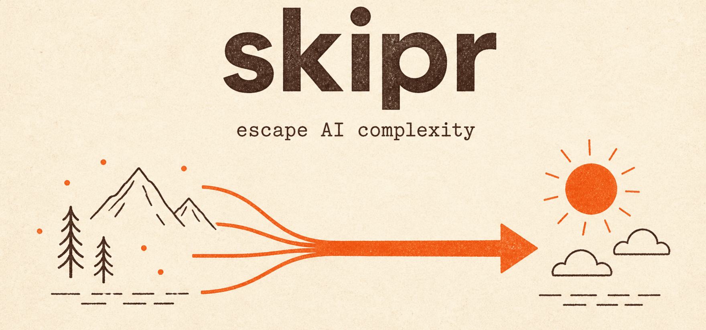

<div align="center">



<br/><br/>

[](#novice-path)
[](#what-skipr-is)
[](./skills/setup-harness/)
[](#a-note-on-branding)

</div>

---

# skipr

**Escape AI complexity.** Few good tools, a harness that can say *no*, and guides by level — Claude Code first. The terminal (Ghostty or yours) is **taught, not hidden**. Rails, not 400 skills.

> This repository **is** the product presentation for now: README + docs + the vendored `setup-harness` skill. A marketing site may return later; personal-site embedding under [mariogarridotorres.com](https://mariogarridotorres.com) is later too.

## What skipr is

skipr helps **creators and builders drowning in AI tooling** set up a lean path you can understand:

| Piece | Role |
|---|---|
| **Terminal** | Ghostty (or Terminal.app / iTerm) — one calm place to work |
| **Agent** | Claude Code CLI in the **project folder** |
| **Harness** | Short `CLAUDE.md` + `checks/` that can fail ([setup-harness](./skills/setup-harness/)) |
| **Guides** | L0/L1 usable now · L2 (Cursor, OpenCode, Hermes, …) later |

You do **not** need another sealed AI stack or a rented no-code black box. You need a folder, a harness, and a CLI you can read.

## Who it’s for

- Photographers / creators who already try Claude in the app and want a folder-scoped setup
- Builders stuck in skill hoards and “Second Brain” sprawl
- Anyone who wants **rails that can say no**, not more prompts

Software-founder desktop-app tracks from earlier MVPs are parked. Start here with L0/L1.

## Novice path

Full step-by-step: **[docs/novice-guide.md](./docs/novice-guide.md)** · Spanish mirror: [docs/es/novice-guide.md](./docs/es/novice-guide.md)

Do this in order (you do not need to be a developer):

1. **Install Claude Code CLI** — the `claude` command, not only the desktop app. Confirm with `claude --version`.
2. **Open a terminal you will actually use** — on macOS we recommend [Ghostty](https://ghostty.org); Terminal.app / iTerm are fine.
3. **Create or open your project folder** — a trip, client job, culling session — not a giant vault of prompts:
   ```bash
   mkdir -p ~/Projects/viaje-lisboa
   cd ~/Projects/viaje-lisboa
   ```
4. **Install and run setup-harness** — copy [`skills/setup-harness/`](./skills/setup-harness/) to `~/.claude/skills/setup-harness/`, then in the project folder:
   ```bash
   claude
   # "Run setup-harness for this folder" / "Monta el harness en esta carpeta"
   ```
5. **Run a checker** — see *no* work:
   ```bash
   ./checks/naming.sh   # or brief-ready.sh / delivery.sh
   ```
6. **First win** — `claude` runs here, short `CLAUDE.md`, at least one executable check, and you understand pass vs fail.

## This grows with you

- **L0 / L1 are the product today** — terminal + Claude Code + harness + these guides.
- **L2 later** — Cursor, OpenCode, Hermes, and similar stay optional. Complexity is not the door to getting started.

Levels overview lives in the [novice guide](./docs/novice-guide.md#levels-l0--l2).

## Repository layout

```text
.
├── README.md                 # this carta (product surface)
├── docs/
│   ├── novice-guide.md       # full beginner path (EN)
│   ├── es/novice-guide.md    # short Spanish mirror
│   ├── design.md             # historical product rationale
│   └── constitution.md       # non-negotiable principles
├── skills/
│   └── setup-harness/        # vendored Claude Code skill + templates
├── landing/                  # skipr.dev static GitHub stub (see landing/README.md)
└── specs/                    # Spec Kit history
```

## Language

- **Product / docs / README:** English (canonical).
- **Working chat with the human:** configurable — set `Working language: es` in project `CLAUDE.md`, or `SKIPR_LOCALE` / `LANG` (default `en`).
- Details: [`docs/language.md`](./docs/language.md). Spanish novice guide: [`docs/es/novice-guide.md`](./docs/es/novice-guide.md) (secondary mirror).

## Skill: setup-harness

Canonical source: **[`skills/setup-harness/SKILL.md`](./skills/setup-harness/SKILL.md)**

Install a copy under `~/.claude/skills/setup-harness/` so Claude Code can load it. Templates (`CLAUDE.md`, checks, optional local skills) live next to the skill.

## Roadmap

- [x] Reposition promise: escape AI complexity (not “hide the terminal”)
- [x] GitHub-first carta: README + novice guide + vendored harness
- [ ] Install script v0 (macOS) when ready
- [ ] L2 track docs (optional advanced tools)
- [ ] Personal-site / skipr.dev marketing — later, not blocking L0/L1

## A note on branding

**skipr is an independent project and is not affiliated with Anthropic.** “Claude” and “Claude Code” are trademarks of their respective owner. Ghostty, GitHub, Cursor, OpenCode, and Hermes are trademarks of their respective owners.


## License

[MIT](./LICENSE) — Copyright (c) 2026 Mario Garrido.

---

<div align="center"><sub>Built for people who want the rails — not another sealed box.</sub></div>
