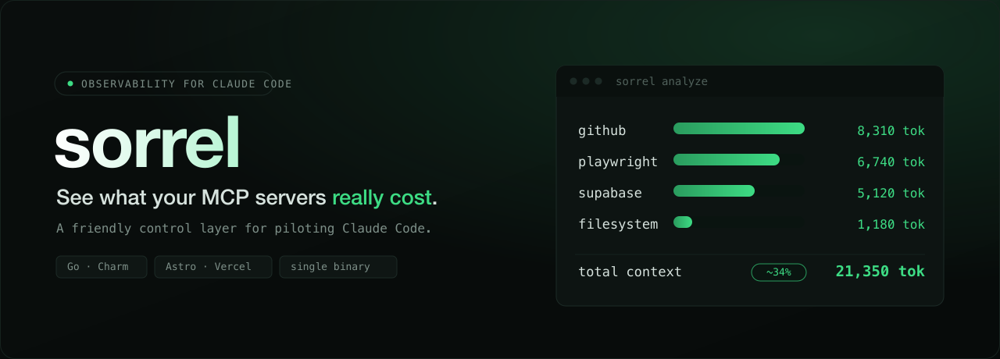

<div align="center">



<br/><br/>

[](#roadmap)
[](./landing)
[](./landing)
[-00ADD8?style=flat-square)](./docs/design.md)
[](#a-note-on-branding)

</div>

---

Sorrel is a friendly control layer for piloting Claude Code: a free, open-source **CLI installer**
plus a paid **TUI dashboard** (Go + Charm). Its hero feature measures **how much of your context
window each MCP server is costing you** — the most-cited, least-addressed Claude Code pain.

```text
$ sorrel analyze
server            tools   context cost
github             42     8,310 tok
playwright         31     6,740 tok
supabase           28     5,120 tok
filesystem          9     1,180 tok
────────────────────────────────────
total                     21,350 tok  (~34% of context)
# est. — measured from each server's tools/list schema
```

## The problem

Every MCP server you connect injects its **full tool schema into every message** — whether you use
those tools or not. Developers measure **30–40% of their context window** lost to schemas they never
call. That's context you pay for on every turn, crowding out your actual code and raising latency
and cost. Nothing on the market makes this **visible**. Sorrel does.

## How it's built — phases, each sellable alone

Sorrel grows in phases (validate first, build the platform later — never the other way around):

| Phase | What | Status |
|------:|------|--------|
| **−1** | **Landing + waitlist + launch article** — validate demand, collect a list | ✅ **built** → [`landing/`](./landing) |
| **0** | MVP: free Go CLI installer + minimal paid TUI (hero = token-cost analyzer) | 🔭 next → [`specs/002-cockpit-mvp`](./specs) |
| **1** | TUI also manages skills/hooks + profiles/projects | 🗺️ planned |
| **2** | Spec-Kit flows from the TUI ("make Claude Code friendly") | 🗺️ planned |

> **Open-core:** the CLI installer is MIT and genuinely useful on its own (the funnel); the TUI
> dashboard + token analyzer are paid (one-time purchase, majors at a discount).

## Repository layout

```text
.
├── landing/                  # Phase −1 — Astro + Vercel marketing site + waitlist (LIVE)
│   ├── src/                  #   hero, waitlist endpoint, articles (content collection)
│   └── supabase/migrations/  #   owned waitlist table (INSERT-only RLS)
├── docs/
│   ├── design.md             # the "why": research, monetization, architecture
│   └── constitution.md       # non-negotiable principles (security, test-first, branding…)
├── specs/
│   └── 001-landing-waitlist/ # spec → plan → tasks → contracts (Spec-Driven Development)
└── KICKOFF.md                # how this repo was bootstrapped
```

This repo follows **Spec-Driven Development** (Spec Kit): every feature is `spec → plan → tasks →
implement`, with a constitution that gates each change.

## The landing (Phase −1, shipped)

A static-first **Astro + Vercel** site in Sorrel's dark terminal aesthetic:

- **Waitlist** stored in our **own Supabase** table (INSERT-only RLS) — works with **JavaScript
  disabled**, honeypot anti-spam, idempotent.
- **Articles** as a content collection (one Markdown file = one article), full SEO/OG/sitemap.
- **Lighthouse ≥ 95** (performance / SEO / accessibility); secrets never committed (gitleaks in CI).

```bash
cd landing
pnpm install
cp .env.example .env      # SUPABASE_* or WAITLIST_DRY_RUN=1
pnpm dev                  # http://localhost:4321
pnpm test && pnpm test:e2e
```

See [`landing/README.md`](./landing/README.md) for full details.

## Roadmap

- [x] Phase −1 — landing + waitlist + launch article
- [ ] Validate demand (collect signups, ship the launch article)
- [ ] Phase 0 — `sorrel` Go CLI installer (MIT) + minimal paid TUI
- [ ] Hero: per-server MCP token-cost analyzer in the TUI
- [ ] Store + licensing (one-time purchase, majors at a discount)

## A note on branding

**Sorrel is an independent project and is not affiliated with Anthropic.** "Claude" and "Claude
Code" are trademarks of their respective owner. Any token-savings figures are **measured estimates**
with a stated method, not guarantees.

---

<div align="center"><sub>Built for people who'd rather pilot their tools than fight them.</sub></div>
